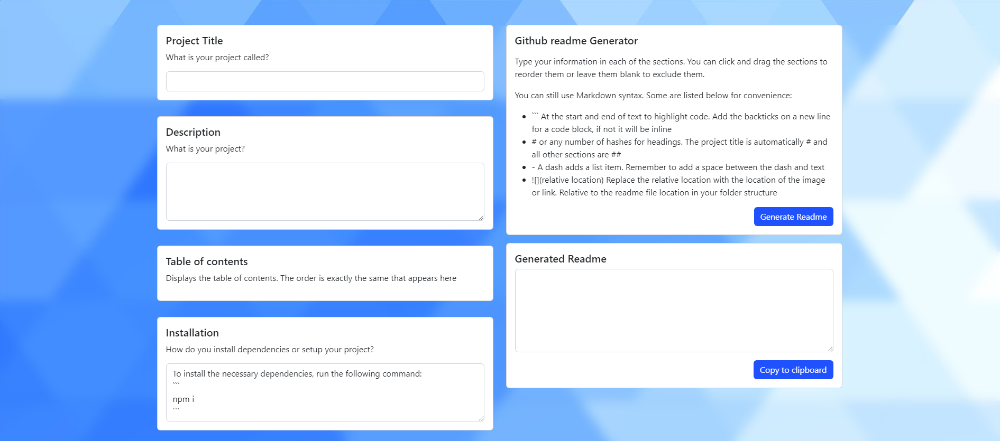

# Github readme generator [](https://opensource.org/licenses/MIT)

## Description
This readme file was generated using this generator! Images, however were manually added at this time. The website is deployed at https://generate-github-readme.herokuapp.com/

This generator allows you to quickly make a readme file without worrying about formatting or manually creating a table of contents. some of the features are listed below:

- Allows you to still use markdown coding if you desire since you will be copying and pasting the markdown code into your readme

- Supports reordering the different sections. Click and drag to reorder. The table of contents will only list the sections that appear underneath

- You can leave a section blank to exclude them from being generated


Things that I would like to add in the future

- The ability to add your own custom sections. At the moment there are only predetermined sections

- Add the ability to link to your github file location. I am hoping to add an auto complete for the file system, as well as making it easier to add images directly here

- I would like to add a preview of the readme file in markdown so you can have a visual representation as well

- Ability to autosave work (maybe cookies or some other form of storage) so you can leave and come back to finish. this naturally also means a button to clear all

## Table of Contents
- [Installation](#installation)

- [Usage](#usage)

- [Contribution](#contribution)

- [License](#license)

## Website


## Installation
To install the necessary dependencies, run the following command:

```

npm i

```

## Usage
- ```npm run watch``` uses nodemon to watch your js files while you are developing

- ```num start``` to run the server by itself

- The local server will be at http://localhost:3001 once you run one of the above commands

## Contribution
If you would like to contribute, you can create a pull request onto main

## License
This project is licensed under the [MIT](https://opensource.org/licenses/MIT) license